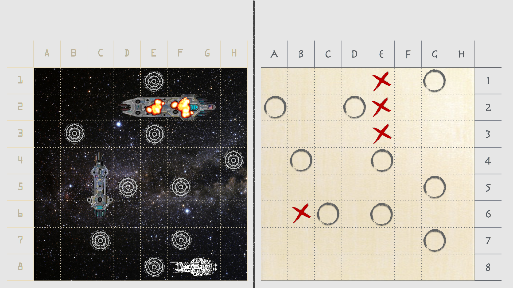
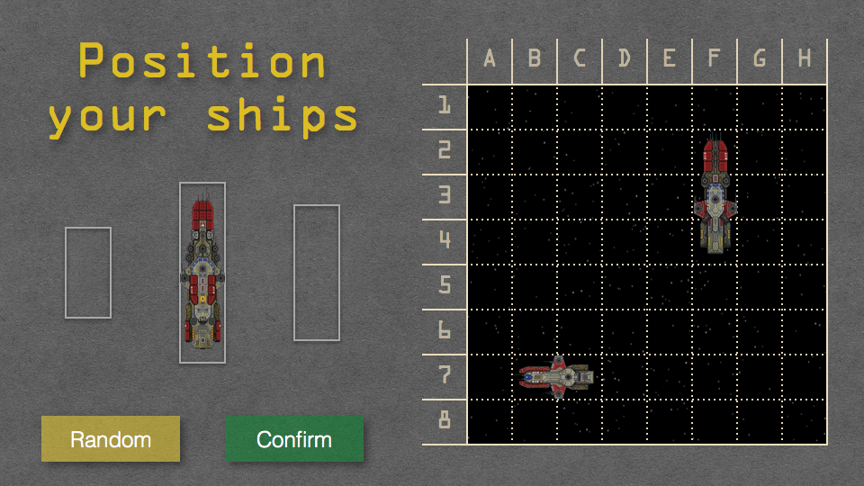
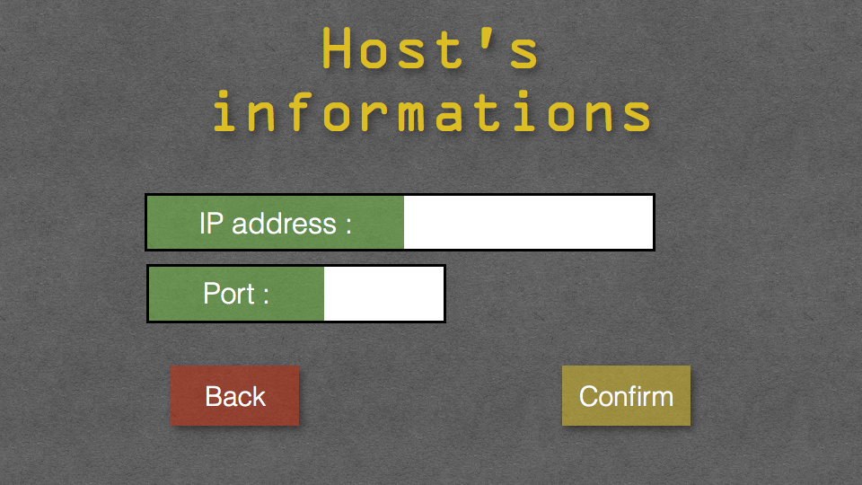

# Navy :

## Description :

I did a battleship game in CSFML a C lib graphic.

In this game you can either to play in Solo vs AI or in Multiplayer (in local network).

To place your ships there is a drag and drop or a random button.

And finally a dialog box for IP and Port.

